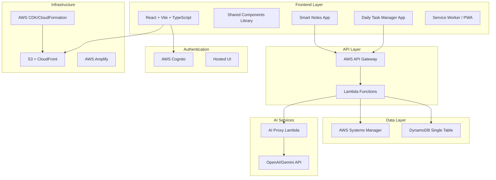

# Design Document

## Overview

KiroweenSkeleton is a modern full-stack dual-application project built entirely on AWS services using serverless architecture. The system consists of two integrated applications - Smart Notes App and Daily Task Manager App - sharing authentication, UI components, backend services, and database infrastructure. The architecture emphasizes scalability, performance, and developer experience while providing AI-powered productivity features.

## Architecture

### High-Level Architecture



### Serverless Architecture Benefits

- **Auto-scaling**: Lambda functions scale automatically based on demand
- **Cost-effective**: Pay only for actual usage, no idle server costs
- **High availability**: AWS manages infrastructure redundancy
- **Fast deployment**: Infrastructure as Code enables rapid deployments
- **Security**: Built-in AWS security features and IAM integration

## Components and Interfaces

### Frontend Components

#### Shared Components Library
- **Button**: Consistent styling with variants (primary, secondary, danger)
- **Input**: Form inputs with validation states and accessibility
- **Card**: Content containers with consistent spacing and shadows
- **Sidebar**: Navigation component with collapsible functionality
- **Navbar**: Top navigation with user menu and theme toggle
- **Modal**: Overlay dialogs for confirmations and forms
- **LoadingSkeleton**: Placeholder components for perceived performance

#### Application-Specific Components
- **NoteEditor**: Markdown editor with preview and AI summarization
- **TaskCard**: Individual task display with status controls
- **Calendar**: Timeline view for task scheduling
- **SearchBar**: Unified search across notes and tasks
- **ThemeToggle**: Light/dark mode switcher with persistence

### Backend Services

#### Lambda Functions Structure
```
backend/
├── functions/
│   ├── notes/
│   │   ├── create-note/
│   │   ├── get-notes/
│   │   ├── update-note/
│   │   └── delete-note/
│   ├── tasks/
│   │   ├── create-task/
│   │   ├── get-tasks/
│   │   ├── update-task/
│   │   └── delete-task/
│   ├── ai-proxy/
│   │   ├── summarize/
│   │   └── schedule/
│   └── notifications/
│       └── send-notification/
```

#### API Gateway Routes
- `POST /api/notes` - Create new note
- `GET /api/notes` - List user notes with pagination
- `PUT /api/notes/{id}` - Update existing note
- `DELETE /api/notes/{id}` - Delete note
- `POST /api/tasks` - Create new task
- `GET /api/tasks` - List user tasks with filtering
- `PUT /api/tasks/{id}` - Update task status/details
- `DELETE /api/tasks/{id}` - Delete task
- `POST /api/ai/summarize` - AI note summarization
- `POST /api/ai/schedule` - AI task scheduling

## Data Models

### DynamoDB Single Table Design

**Table Name**: `KiroweenSkeleton`

**Key Structure**:
- **PK (Partition Key)**: `USER#{userId}`
- **SK (Sort Key)**: `{ENTITY_TYPE}#{entityId}#{optional_suffix}`

**Entity Patterns**:

```typescript
// User Profile
{
  PK: "USER#123",
  SK: "PROFILE",
  type: "profile",
  email: "user@example.com",
  name: "John Doe",
  theme: "dark",
  createdAt: "2024-01-01T00:00:00Z"
}

// Note
{
  PK: "USER#123",
  SK: "NOTE#note-456",
  type: "note",
  title: "Meeting Notes",
  content: "# Meeting with team...",
  tags: ["work", "meeting"],
  summary: "AI generated summary...",
  createdAt: "2024-01-01T10:00:00Z",
  updatedAt: "2024-01-01T11:00:00Z"
}

// Note Revision
{
  PK: "USER#123",
  SK: "REVISION#note-456#v1",
  type: "revision",
  noteId: "note-456",
  version: 1,
  content: "Previous version content...",
  createdAt: "2024-01-01T10:00:00Z"
}

// Task
{
  PK: "USER#123",
  SK: "TASK#task-789",
  type: "task",
  title: "Complete project",
  description: "Finish the KiroweenSkeleton project",
  status: "pending", // pending, in-progress, completed
  priority: "high", // low, medium, high
  deadline: "2024-01-15T23:59:59Z",
  createdAt: "2024-01-01T12:00:00Z"
}

// Notification
{
  PK: "USER#123",
  SK: "NOTIF#notif-101",
  type: "notification",
  taskId: "task-789",
  message: "Task deadline approaching",
  scheduledFor: "2024-01-15T20:00:00Z",
  sent: false
}
```

### Query Patterns

**Get all notes for user**:
```
PK = "USER#123" AND SK begins_with "NOTE#"
```

**Get all tasks for user**:
```
PK = "USER#123" AND SK begins_with "TASK#"
```

**Get note revisions**:
```
PK = "USER#123" AND SK begins_with "REVISION#note-456#"
```

## Error Handling

### Frontend Error Handling
- **Network Errors**: Retry mechanism with exponential backoff
- **Authentication Errors**: Automatic redirect to login with session restoration
- **Validation Errors**: Real-time form validation with clear error messages
- **AI Service Errors**: Graceful degradation with manual alternatives
- **Offline Handling**: Service worker cache with sync when online

### Backend Error Handling
- **Lambda Error Responses**: Standardized error format with HTTP status codes
- **DynamoDB Errors**: Retry logic for throttling and temporary failures
- **AI API Errors**: Fallback responses and error logging
- **Input Validation**: Schema validation with detailed error messages
- **Rate Limiting**: Implement throttling to prevent abuse

### Error Response Format
```typescript
interface ErrorResponse {
  error: {
    code: string;
    message: string;
    details?: any;
    timestamp: string;
  }
}
```

## Testing Strategy

### Unit Testing
- **Component Testing**: React Testing Library for UI components
- **Hook Testing**: Custom hooks with mock providers
- **Lambda Testing**: Jest with AWS SDK mocks
- **Utility Testing**: Pure function testing for business logic

### Property-Based Testing
The system will use **fast-check** for JavaScript/TypeScript property-based testing to verify universal properties across all inputs. Each property-based test will run a minimum of 100 iterations to ensure comprehensive coverage.

### Integration Testing
- **API Testing**: End-to-end API workflows with test database
- **Authentication Flow**: Complete login/logout cycles
- **AI Integration**: Mock AI responses for consistent testing
- **Database Operations**: CRUD operations with test data

### Performance Testing
- **Load Testing**: Simulate concurrent users with Artillery
- **Bundle Analysis**: Webpack bundle analyzer for optimization
- **Lighthouse Audits**: Performance, accessibility, and SEO scores
- **Database Performance**: Query optimization and indexing validation

## Correctness Properties

*A property is a characteristic or behavior that should hold true across all valid executions of a system-essentially, a formal statement about what the system should do. Properties serve as the bridge between human-readable specifications and machine-verifiable correctness guarantees.*

### Authentication Properties

**Property 1: Authentication state sharing**
*For any* authenticated user session, access should be granted to both Smart Notes and Daily Task Manager applications without additional authentication
**Validates: Requirements 1.2**

**Property 2: Session persistence across navigation**
*For any* authenticated user, navigating between applications should maintain the authentication state without requiring re-login
**Validates: Requirements 1.3**

**Property 3: Global logout behavior**
*For any* authenticated user, logging out from either application should terminate access to both applications
**Validates: Requirements 1.4**

### UI Consistency Properties

**Property 4: Theme consistency across applications**
*For any* UI component rendered in either application, it should use the same Tailwind CSS classes and design system variables
**Validates: Requirements 2.1**

**Property 5: Theme synchronization**
*For any* theme toggle action in either application, the theme preference should be applied consistently across both applications
**Validates: Requirements 2.2**

**Property 6: Shared component usage**
*For any* UI element in either application, it should use components from the shared components library with consistent behavior and styling
**Validates: Requirements 2.3**

**Property 7: Responsive layout consistency**
*For any* viewport size, both applications should maintain consistent spacing, typography, and color schemes
**Validates: Requirements 2.4**

**Property 8: Loading state consistency**
*For any* loading operation in either application, the system should display consistent loading skeletons and animations
**Validates: Requirements 2.5**

### Notes Application Properties

**Property 9: Note creation with user association**
*For any* note created by a user, it should be stored in DynamoDB with the correct user association and all required fields
**Validates: Requirements 3.1**

**Property 10: AI summarization processing**
*For any* note submitted for AI summarization, the system should return a structured JSON response with consistent formatting
**Validates: Requirements 3.2**

**Property 11: Automatic revision creation**
*For any* note that is summarized, the system should automatically create a revision record in DynamoDB
**Validates: Requirements 3.3**

**Property 12: Search result filtering**
*For any* search query, the returned results should only include notes that match the content or tag filters
**Validates: Requirements 3.4**

**Property 13: Version history preservation**
*For any* note edit operation, the previous version should be preserved as a revision in DynamoDB
**Validates: Requirements 3.5**

### Task Management Properties

**Property 14: Task creation with complete data**
*For any* task created by a user, it should be stored with all required fields (deadline, priority, status) in DynamoDB
**Validates: Requirements 4.1**

**Property 15: AI scheduling optimization**
*For any* set of tasks with deadlines and priorities, the AI scheduling should generate time slots that respect priority ordering and deadline constraints
**Validates: Requirements 4.2**

**Property 16: Deadline notification triggering**
*For any* task with an approaching deadline, the system should trigger browser notifications at the appropriate time
**Validates: Requirements 4.3**

**Property 17: Real-time status updates**
*For any* task status change, all views displaying that task should immediately reflect the updated status
**Validates: Requirements 4.4**

**Property 18: Calendar timeline display**
*For any* set of tasks, the calendar view should display all tasks in chronological order with proper visual organization
**Validates: Requirements 4.5**

### AI Integration Properties

**Property 19: Secure AI proxy usage**
*For any* AI request, it should be processed through the Lambda proxy without exposing API keys to the client
**Validates: Requirements 6.1**

**Property 20: AI error handling**
*For any* AI service failure, the system should handle errors gracefully and provide fallback options without crashing
**Validates: Requirements 6.3**

**Property 21: AI summary format consistency**
*For any* AI-generated summary, the response should conform to the expected JSON schema with required fields
**Validates: Requirements 6.4**

**Property 22: AI schedule timeframe compliance**
*For any* AI-generated schedule, it should cover exactly the next 3 days and organize tasks based on priority levels
**Validates: Requirements 6.5**

### Performance Properties

**Property 23: Offline data availability**
*For any* cached data, it should be available when the network is unavailable, allowing continued application usage
**Validates: Requirements 7.2**

**Property 24: Code splitting implementation**
*For any* page navigation, only the required code chunks should be loaded, demonstrating proper lazy loading
**Validates: Requirements 7.3**

**Property 25: Caching mechanism usage**
*For any* data operation, appropriate caching should be used (LocalStorage for sessions, RTK Query for API responses)
**Validates: Requirements 7.4**

**Property 26: Loading skeleton display**
*For any* loading operation, appropriate skeleton components should be rendered to improve perceived performance
**Validates: Requirements 7.5**

### Productivity Features Properties

**Property 27: Productivity score calculation**
*For any* user activity, the daily productivity score should be calculated and updated based on completed tasks and notes created
**Validates: Requirements 8.1**

**Property 28: Export functionality completeness**
*For any* export operation, the output should contain all user data in the specified format (PDF for notes, JSON for backup)
**Validates: Requirements 8.2**

**Property 29: Keyboard shortcut responsiveness**
*For any* registered keyboard shortcut, the corresponding action should be executed when the shortcut is triggered
**Validates: Requirements 8.3**

**Property 30: Animation implementation**
*For any* UI interaction, smooth animations should be applied using Framer Motion for enhanced user experience
**Validates: Requirements 8.5**